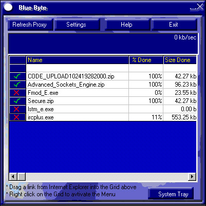



## BlueByte \- \(Go\!zilla like program\)

### Description

It is a program like GO!zilla. Drag from IE into the listbox and save the location. Right click on the listbox to activate the menu. Downloads HTTP and FTP with progress indicators. Calculates the bytes per second like Gozilla. Saves the download list like GO!ZILLA .Only tested with proxy, but modem should be fine. Please open the Group and not just the Project. Oh yes...it is skinned.
 
### More Info
 

             |
---                |---
**Submitted On**   |2000-10-19 08:33:54
**By**             |[N/A](https://github.com/Planet-Source-Code/PSCIndex/blob/master/ByAuthor/empty.md)
**Level**          |Advanced
**User Rating**    |4.8 (111 globes from 23 users)
**Compatibility**  |VB 6\.0
**Category**       |[Complete Applications](https://github.com/Planet-Source-Code/PSCIndex/blob/master/ByCategory/complete-applications__1-27.md)
**World**          |[Visual Basic](https://github.com/Planet-Source-Code/PSCIndex/blob/master/ByWorld/visual-basic.md)
**Archive File**   |[CODE\_UPLOAD1077610192000\.zip](https://github.com/Planet-Source-Code/bluebyte-go-zilla-like-program__1-12147/archive/master.zip)

